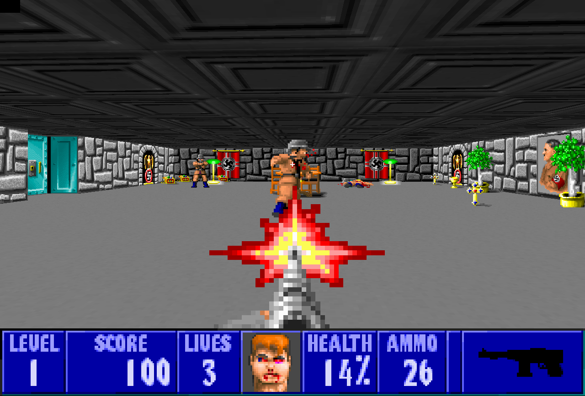
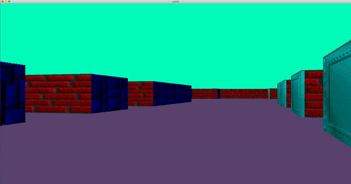

<div align="center">
  
  <h1>cub3d</h1>
</div>
<div align="center">
  
</div>

#### What is cub3d?
This project is inspired by the world-famous Wolfenstein 3D game, which
was the first FPS ever. It will enable you to explore ray-casting. Your goal will be to
make a dynamic view inside a maze, in which you’ll have to find your way.

#### Usage
```bash
git clone https://github.com/s-sergiu/cub3D.git
```
```bash
cd cub3D
```
```bash
make
```
Choose one of the valid maps in the data/maps folder, Here is an example to use a valid map
```bash
./cub3D data/maps/rectangle.cub
```
If the map is invalid, it was provided just to perform tests during the evaluation.
